# Docker

Docker es la herramienta más popular para trabajar con contenedores. En esta sección vas a aprender su arquitectura, sus abstracciones fundamentales y los comandos esenciales para construir y ejecutar contenedores.

## Arquitectura cliente-servidor

Docker usa una arquitectura **cliente-servidor**. Cuando escribes `docker run`, no es el comando el que ejecuta el contenedor — el comando le pide a un **daemon** (servidor en segundo plano) que lo haga.

```mermaid
graph LR
    CLI[Docker CLI] -->|API REST| D[dockerd - Daemon]
    D --> CD[containerd]
    CD --> R[runc]
    R --> C1[Contenedor 1]
    R --> C2[Contenedor 2]
    R --> C3[Contenedor 3]

    style CLI fill:#4a3080,stroke:#7c5cbf
    style D fill:#2d5a1e,stroke:#4a8f32
    style CD fill:#1a3a5c,stroke:#2a6a9c
    style R fill:#8b1a1a,stroke:#cc3333
```



| Componente | Rol |
|-----------|-----|
| **Docker CLI** | El comando que escribes en la terminal. Traduce tus instrucciones a llamadas API. |
| **dockerd** | El daemon (servidor). Escucha peticiones y coordina todo. Corre como root. |
| **containerd** | Maneja el ciclo de vida de los contenedores (crear, iniciar, parar, eliminar). |
| **runc** | El runtime de bajo nivel que realmente crea el contenedor (configura namespaces y cgroups). |

Esto significa que **Docker necesita un daemon corriendo** en todo momento. Si el daemon se cae, **todos los contenedores dejan de funcionar**. Este es uno de los puntos débiles de Docker que Podman resuelve (lo veremos en la siguiente sección).

## Las tres abstracciones de Docker

Docker tiene tres conceptos fundamentales que necesitas entender. Piénsalo como cocinar:


| Concepto | Analogía | ¿Qué es? |
|----------|----------|-----------|
| **Dockerfile** | La receta | Un archivo de texto con instrucciones paso a paso para construir una imagen |
| **Image** | Un platillo congelado | Un paquete inmutable con tu app + dependencias, listo para ejecutar |
| **Container** | El platillo servido | Una instancia en ejecución de una imagen — un proceso vivo |

Puntos clave:
- De un Dockerfile puedes construir **una imagen**
- De una imagen puedes crear **muchos contenedores** (como hacer muchos platillos del mismo congelado)
- Los contenedores son **efímeros** — puedes crearlos y destruirlos sin afectar la imagen
- Las imágenes son **inmutables** — para cambiar algo, reconstruyes la imagen

## El sistema de capas

Las imágenes de Docker no son un solo bloque. Están compuestas de **capas** (layers), donde cada instrucción del Dockerfile crea una nueva capa.

```mermaid
graph TB
    L1[Capa 1: FROM ubuntu:22.04 - SO base] --> L2[Capa 2: RUN apt-get update - Paquetes del sistema]
    L2 --> L3[Capa 3: COPY app.py . - Tu código]
    L3 --> L4[Capa 4: CMD python app.py - Comando de inicio]

    style L1 fill:#1a3a5c,stroke:#2a6a9c
    style L2 fill:#2d5a1e,stroke:#4a8f32
    style L3 fill:#4a3080,stroke:#7c5cbf
    style L4 fill:#8b1a1a,stroke:#cc3333
```



¿Por qué capas?

- **Cache**: Si cambias solo tu código (Capa 3), Docker reutiliza las capas anteriores. No reinstala paquetes cada vez.
- **Compartidas**: Si dos imágenes usan `ubuntu:22.04`, comparten esa capa en disco. No se duplica.
- **Eficiencia**: Las capas son de solo lectura. El contenedor agrega una capa escribible encima.

> **Tip**: Ordena tu Dockerfile de lo que cambia **menos** (SO base, dependencias) a lo que cambia **más** (tu código). Así aprovechas mejor el cache.

## Dockerfile: la receta

Un Dockerfile es un archivo de texto (sin extensión) con instrucciones para construir una imagen.

### Comandos del Dockerfile

| Comando | ¿Qué hace? | Ejemplo |
|---------|------------|---------|
| `FROM` | Define la imagen base. **Siempre es la primera instrucción.** | `FROM ubuntu:22.04` |
| `RUN` | Ejecuta un comando durante la **construcción** de la imagen. | `RUN apt-get update && apt-get install -y curl` |
| `COPY` | Copia archivos de tu máquina a la imagen. | `COPY app.py /app/` |
| `WORKDIR` | Define el directorio de trabajo dentro de la imagen. | `WORKDIR /app` |
| `CMD` | Comando que se ejecuta cuando **arranca** el contenedor. Solo uno por Dockerfile. | `CMD ["python", "app.py"]` |
| `ENTRYPOINT` | Similar a CMD pero no se puede sobreescribir fácilmente. | `ENTRYPOINT ["python"]` |
| `ENV` | Define variables de entorno. | `ENV MI_VAR=valor` |
| `EXPOSE` | Documenta qué puertos usa la aplicación (no los abre). | `EXPOSE 8080` |

### `CMD` vs `ENTRYPOINT`

- **`CMD`**: "Si no me dices qué hacer, hago esto." Se sobreescribe si pasas argumentos a `docker run`.
- **`ENTRYPOINT`**: "Siempre voy a ejecutar esto." Los argumentos de `docker run` se agregan como parámetros.

```dockerfile
# Con CMD: el usuario puede cambiar el comando completo
CMD ["python", "app.py"]
# docker run mi-imagen          → python app.py
# docker run mi-imagen bash     → bash (CMD reemplazado)

# Con ENTRYPOINT: el usuario agrega argumentos
ENTRYPOINT ["python"]
CMD ["app.py"]
# docker run mi-imagen          → python app.py
# docker run mi-imagen test.py  → python test.py (ENTRYPOINT fijo, CMD reemplazado)
```

## Ejemplo paso a paso: script de bash en un contenedor

Vamos a crear un contenedor que ejecute un script de bash que muestra información del sistema.

### 1. Crea el script

Crea un archivo llamado `info.sh`:

```bash
#!/bin/bash
echo "=== Información del sistema ==="
echo "Hostname: $(hostname)"
echo "Usuario: $(whoami)"
echo "Directorio: $(pwd)"
echo "Fecha: $(date)"
echo "Kernel: $(uname -r)"
echo ""
echo "=== Procesos ==="
ps aux
echo ""
echo "=== Memoria ==="
free -h 2>/dev/null || echo "(free no disponible)"
echo ""
echo "=== Disco ==="
df -h /
```

### 2. Crea el Dockerfile

```dockerfile
# Imagen base: ubuntu 22.04
FROM ubuntu:22.04

# Crear directorio de trabajo
WORKDIR /app

# Copiar el script al contenedor
COPY info.sh .

# Dar permisos de ejecución
RUN chmod +x info.sh

# Ejecutar el script al arrancar
CMD ["./info.sh"]
```

### 3. Construir la imagen

```bash
docker build -t mi-info .
```

Desglose:
- `docker build` — construye una imagen
- `-t mi-info` — le da el nombre (tag) "mi-info"
- `.` — contexto de build (directorio actual, donde está el Dockerfile)

### 4. Ejecutar el contenedor

```bash
docker run mi-info
```

Deberías ver la información del sistema **del contenedor**, no de tu máquina host. Nota cómo:
- El hostname es un ID aleatorio (no el nombre de tu máquina)
- El usuario es root (dentro del contenedor)
- Solo se ven los procesos del contenedor (no los de tu máquina)

## `docker build`

El comando `docker build` lee un Dockerfile y crea una imagen.

```bash
docker build [opciones] <contexto>
```

| Flag | Descripción | Ejemplo |
|------|------------|---------|
| `-t nombre:tag` | Nombre y versión de la imagen | `-t mi-app:v1` |
| `-f archivo` | Usar un Dockerfile específico (si no se llama `Dockerfile`) | `-f Dockerfile.dev` |
| `--no-cache` | Reconstruir sin usar cache de capas | `--no-cache` |
| `--build-arg KEY=VAL` | Pasar variables al build | `--build-arg VERSION=3.11` |

```bash
# Ejemplos
docker build -t mi-app .                    # build básico
docker build -t mi-app:v2 .                 # con versión
docker build -t mi-app -f Dockerfile.dev .   # Dockerfile custom
docker build --no-cache -t mi-app .          # sin cache
```

## `docker run`

El comando `docker run` crea y ejecuta un contenedor a partir de una imagen.

```bash
docker run [opciones] <imagen> [comando]
```

| Flag | Descripción | Ejemplo |
|------|------------|---------|
| `-d` | Ejecutar en segundo plano (detached) | `docker run -d nginx` |
| `-it` | Modo interactivo con terminal | `docker run -it ubuntu bash` |
| `--name` | Asignar un nombre al contenedor | `--name mi-server` |
| `-p host:cont` | Mapear puertos (host → contenedor) | `-p 8080:80` |
| `-v host:cont` | Montar volumen (compartir directorio) | `-v ./data:/app/data` |
| `--rm` | Eliminar el contenedor al terminar | `--rm` |
| `-e VAR=val` | Definir variable de entorno | `-e DB_HOST=localhost` |
| `--memory` | Limitar memoria | `--memory=512m` |
| `--cpus` | Limitar CPUs | `--cpus=2` |

```bash
# Ejemplos comunes
docker run hello-world                           # contenedor simple
docker run -it ubuntu bash                       # terminal interactiva
docker run -d -p 8080:80 --name web nginx        # servidor web en background
docker run --rm -v $(pwd):/app python:3.11 python /app/script.py  # ejecutar script
docker run -d --memory=256m --cpus=1 mi-app      # con límites de recursos
```

### Flujo completo


## Comandos esenciales de Docker

| Comando | ¿Qué hace? | Ejemplo |
|---------|------------|---------|
| `docker build` | Construye imagen desde Dockerfile | `docker build -t app .` |
| `docker run` | Crea y ejecuta un contenedor | `docker run -it ubuntu bash` |
| `docker ps` | Lista contenedores en ejecución | `docker ps` |
| `docker ps -a` | Lista **todos** los contenedores (incluidos detenidos) | `docker ps -a` |
| `docker stop` | Detiene un contenedor | `docker stop mi-server` |
| `docker rm` | Elimina un contenedor detenido | `docker rm mi-server` |
| `docker images` | Lista imágenes locales | `docker images` |
| `docker rmi` | Elimina una imagen | `docker rmi mi-app:v1` |
| `docker logs` | Muestra la salida (stdout/stderr) de un contenedor | `docker logs mi-server` |
| `docker exec` | Ejecuta un comando **dentro** de un contenedor en ejecución | `docker exec -it mi-server bash` |
| `docker pull` | Descarga una imagen de Docker Hub | `docker pull python:3.11` |
| `docker inspect` | Muestra detalles técnicos de un contenedor o imagen | `docker inspect mi-server` |

### Limpieza

Con el uso, Docker acumula contenedores detenidos, imágenes sin usar y volúmenes huérfanos. Limpia periódicamente:

```bash
# Eliminar todos los contenedores detenidos
docker container prune

# Eliminar imágenes sin tag (dangling)
docker image prune

# Limpieza total (contenedores, imágenes, redes sin usar)
docker system prune

# Ver cuánto espacio usa Docker
docker system df
```

## Ejercicios

:::exercise{title="Tu primer contenedor" difficulty="1"}

1. Ejecuta un contenedor de Ubuntu en modo interactivo:

```bash
docker run -it --rm ubuntu bash
```

2. Dentro del contenedor, ejecuta:

```bash
whoami
hostname
cat /etc/os-release
ps aux
ls /
```

3. Intenta ejecutar `docker` dentro del contenedor. ¿Funciona? ¿Por qué no?

4. Sal del contenedor con `exit`. ¿Qué le pasa al contenedor? (Pista: usamos `--rm`)

:::

:::exercise{title="Construir tu propia imagen" difficulty="2"}

1. Crea un directorio de trabajo:

```bash
mkdir mi-primer-imagen && cd mi-primer-imagen
```

2. Crea un script `hola.sh`:

```bash
#!/bin/bash
echo "Hola, soy un contenedor!"
echo "Me llamo: $(hostname)"
echo "La hora es: $(date)"
echo "Argumento recibido: ${1:-ninguno}"
```

3. Crea un `Dockerfile`:

```dockerfile
FROM ubuntu:22.04
WORKDIR /app
COPY hola.sh .
RUN chmod +x hola.sh
ENTRYPOINT ["./hola.sh"]
```

4. Construye la imagen:

```bash
docker build -t hola .
```

5. Ejecútala de tres formas:

```bash
docker run --rm hola
docker run --rm hola "mundo"
docker run --rm hola "desde Docker"
```

6. ¿Qué diferencia notas entre las tres ejecuciones? ¿Cómo se relaciona con `ENTRYPOINT`?

:::

:::exercise{title="Explorar aislación" difficulty="2"}

Este ejercicio demuestra la aislación entre contenedores y el host.

1. En tu **máquina host**, crea un archivo:

```bash
echo "archivo del host" > /tmp/prueba_host.txt
```

2. Lanza un contenedor y busca ese archivo:

```bash
docker run --rm ubuntu ls /tmp/
```

¿Aparece `prueba_host.txt`? ¿Por qué?

3. Ahora monta el directorio:

```bash
docker run --rm -v /tmp:/tmp_host ubuntu cat /tmp_host/prueba_host.txt
```

¿Ahora sí aparece? ¿Qué cambió?

4. Modifica el archivo **desde el contenedor**:

```bash
docker run --rm -v /tmp:/tmp_host ubuntu bash -c 'echo "modificado desde contenedor" >> /tmp_host/prueba_host.txt'
```

5. Verifica en tu host:

```bash
cat /tmp/prueba_host.txt
```

¿Qué conclusión puedes sacar sobre los volúmenes y la aislación?

:::

:::exercise{title="Volúmenes y persistencia" difficulty="2"}

Los contenedores son efímeros — cuando se eliminan, su contenido desaparece. Los volúmenes permiten persistir datos.

1. Ejecuta un contenedor y crea un archivo **sin volumen**:

```bash
docker run --name efimero ubuntu bash -c 'echo "datos importantes" > /tmp/datos.txt'
docker start -a efimero  # ¿sigue el archivo?
docker rm efimero         # adiós contenedor y datos
```

2. Ahora con volumen:

```bash
mkdir -p /tmp/mis-datos
docker run --rm -v /tmp/mis-datos:/datos ubuntu bash -c 'echo "datos persistentes" > /datos/resultado.txt'
cat /tmp/mis-datos/resultado.txt  # ¿sobrevive fuera del contenedor?
```

3. Crea otro contenedor que use el **mismo volumen**:

```bash
docker run --rm -v /tmp/mis-datos:/datos ubuntu cat /datos/resultado.txt
```

¿Qué implicaciones tiene esto para compartir datos entre contenedores?

:::

:::prompt{title="Debugging de Docker" for="ChatGPT/Claude"}

Estoy aprendiendo Docker. Al intentar construir/ejecutar un contenedor, obtuve un error.

**Mi Dockerfile:**

```dockerfile
[pega tu Dockerfile aquí]
```

**Comando ejecutado:**

```bash
[pega tu comando aquí]
```

**Error:**

```
[pega el error aquí]
```

¿Qué está mal y cómo lo soluciono? Explícame paso a paso.

:::

:::prompt{title="Crear Dockerfile para mi proyecto" for="ChatGPT/Claude"}

Necesito crear un Dockerfile para mi proyecto. Aquí están los detalles:

- **Lenguaje**: [Python/Node/etc.]
- **Dependencias**: [lista las dependencias o archivo de dependencias]
- **Comando para ejecutar**: [cómo se corre la aplicación]
- **Puerto** (si aplica): [qué puerto usa]

Crea un Dockerfile optimizado, explicando cada línea.

:::
